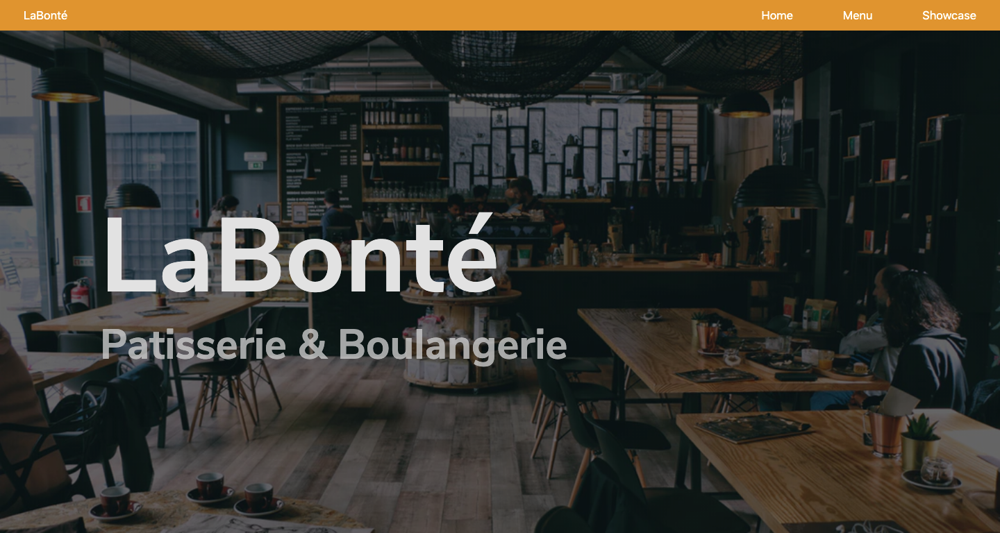

# Restaurant Page

[Restaurant Page](https://raw.githack.com/KaushikShivam/restaurant_page/feature-restaurant/dist/index.html) is a Restaurant page project from the odin project that I built for Microverse. This uses Webpack and babel to bundle and transpile respectively.
The project is built using modern JS features and follows a basic version of MCV architecture


## Table of content

- [Description](#Description)
- [Installation](#installation)
- [Contact](#contact)

## Description

The Restaurant Page is a project from the odin project that I built for Microverse. This uses Webpack and babel to bundle and transpile respectively.
The project is built using modern JS features and follows a basic version of MCV architecture

## Installation

1. Clone the project to your local directory

```
git clone https://github.com/KaushikShivam/concentration
```

2. The project uses NPM for managing dependencies. Run npm install to install all the required dependencies

```
npm install
```

3. Run the task runner to run the app

```
npm run start
```

## Contact

You can contact me at:

- [Portfolio](https://www.shivamkaushik.com)
- [Email](mailto:shivamkaushikofficial@gmail.com)
- [Linkedin](https://www.linkedin.com/in/kshivamdev/)
- [Twitter](https://twitter.com/kShivamDev)
- [Medium](https://medium.com/@shivamkaushikofficial)
- [Angellist](https://angel.co/kshivamdev)
